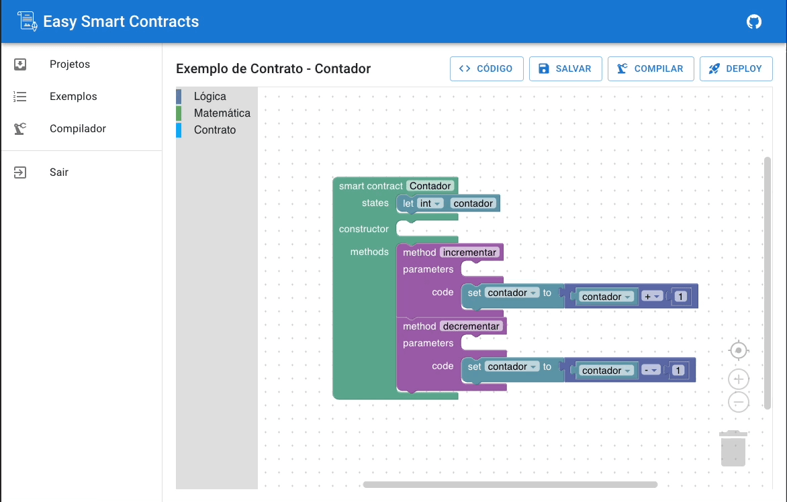

# Easy Smart Contracts

Easy Smart Contracts is a low-code open source web platform that allows the creation and implementation of smart contracts
on the Ethereum network, through a friendly and intuitive interface, without the need for previous programming knowledge.

## Solidity support

The Blockly editor targets Solidity 0.8.20 and newer, and the in-browser compiler currently uses Solidity 0.8.37. It provides structured blocks for:

- contracts, abstract contracts, interfaces, libraries, and inheritance;
- state variables with arbitrary types, visibility, and `constant`, `immutable`, or `transient` storage;
- structs, enums, events, custom errors, constructors, modifiers, functions, `receive`, and `fallback`;
- local declarations, unchecked blocks, memory-safe assembly, expressions, and arbitrary statements.

Solidity evolves more quickly than a visual block library can. Context-specific **raw source**, **top-level**, **contract member**, **statement**, and **expression** blocks therefore act as forward-compatible escape hatches. Together they make every Solidity and inline-Yul grammar production representable without forcing an entire contract into one text block. Raw blocks are compiled normally and should be reviewed with the same care as hand-written Solidity.
