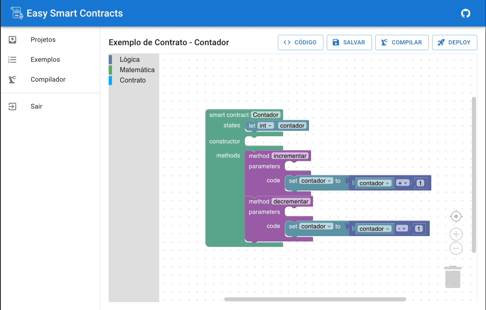

# Easy Smart Contracts

Easy Smart Contracts é uma plataforma web open source low-code que possibilita a criação e implantação de contratos
inteligentes na rede Ethereum, por meio de uma interface amigável e intuitiva, sem a necessidade de conhecimento prévio em programação.
